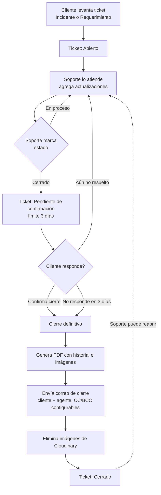

# Sistema de Tickets — INCAP

Sistema interno de atención a clientes (soporte técnico) multi-empresa, hecho en Django. Permite que los clientes de varias empresas levanten incidentes o requerimientos, que un equipo de soporte los atienda, y que el cierre quede documentado y notificado por correo.

## ¿Qué hace el sistema?

- Cada **empresa** (cliente de INCAP) tiene sus propios usuarios y tickets, aislados del resto.
- Los **clientes** levantan tickets (incidente o requerimiento), opcionalmente con imágenes de evidencia.
- El equipo de **soporte** los atiende desde una bandeja, agrega actualizaciones y, al resolverlos, el ticket pasa a **pendiente de confirmación** en vez de cerrarse de inmediato.
- El cliente confirma que quedó resuelto (o indica que no), y si no responde en 3 días el ticket se cierra solo.
- Al cerrarse (por confirmación o automático), se genera un **PDF con el historial completo** (incluye las imágenes antes de borrarlas), se manda un **correo de cierre**, y se liberan las imágenes de la nube.
- Todas las tablas del sistema (tickets, usuarios, empresas) tienen **filtros por columna** y se pueden **exportar a CSV o Excel**.

## Roles y permisos

| Rol | Puede |
|---|---|
| **Super admin** | Ver y editar todo, sin restricciones |
| **Agente de Soporte** | Ver y atender todos los tickets de sus empresas asignadas (bandeja, actualizaciones, cierres) |
| **Agente Cliente** | Levantar tickets, crear usuarios clientes de su empresa, ver (solo lectura) los tickets de todos los usuarios de su empresa |
| **Cliente** | Levantar tickets y ver/comentar únicamente los suyos |

El login acepta usuario **o correo electrónico**.

## Flujo habitual de un ticket

## Funcionalidades importantes

- **Imágenes en tickets**: hasta 3 por envío, 5MB cada una, almacenadas en **Cloudinary** (no en el servidor).
- **Cierre con confirmación del cliente**: nunca se cierra un ticket de forma directa al marcarlo "Cerrado"; siempre pasa por la etapa de confirmación. El auto-cierre por vencimiento se revisa cada vez que soporte carga la bandeja de tickets (no es un cron real).
- **PDF de cierre**: se genera con `reportlab`, se guarda en Cloudinary (almacenamiento tipo *raw*), y se adjunta directo en el correo (no se expone ningún link público desde la app).
- **Correo de cierre**: vía Gmail SMTP. Va al cliente y al agente que atendió; en copia el contacto alternativo si es un correo válido; en copia oculta siempre la dirección configurada en `EMAIL_BCC_CIERRE`.
- **Filtros y exportación**: cada tabla tiene una fila de filtros (uno por columna, con los valores reales encontrados) más un buscador general. Los botones de exportar (CSV/Excel) exportan exactamente lo que está filtrado/visible en pantalla, no la tabla completa. El Excel es un `.xlsx` real, generado en el navegador sin dependencias externas.
- **Zona horaria**: la base de datos guarda todo en UTC. Un middleware (`tickets/middleware.py`) detecta la zona horaria del navegador de cada visitante (vía cookie) y localiza automáticamente todas las fechas mostradas y exportadas — sin tocar cómo se almacenan.
- **Reloj y versión del sistema**: en el header de cada pantalla se muestra la hora en vivo con su zona horaria, y debajo la versión del sistema (`v<commits> (<hash>)`), calculada automáticamente desde el historial de git — avanza sola con cada commit/merge.
- **Borrado de empresas**: es un soft-delete (se marca `eliminada=True` y se renombra con fecha), nunca se borra de verdad para conservar el historial de tickets.

## Stack

- **Backend**: Django 5.2, SQLite (desarrollo).
- **Imágenes y PDFs**: Cloudinary (`django-cloudinary-storage`).
- **Correo**: SMTP (Gmail).
- **Frontend**: HTML/CSS/JS simple por plantilla, sin frameworks ni build step.

## Configuración

1. `pip install -r requirements.txt`
2. Copiar `.env.example` a `.env` y completar:
   - `CLOUDINARY_CLOUD_NAME`, `CLOUDINARY_API_KEY`, `CLOUDINARY_API_SECRET`
   - `EMAIL_HOST_USER`, `EMAIL_HOST_PASSWORD` (contraseña de aplicación de Gmail)
   - `EMAIL_BCC_CIERRE` (correo que siempre recibe copia oculta al cerrar un ticket)
3. `python manage.py migrate`
4. `python manage.py runserver`

## Pendientes conocidos

- Hay 3 imágenes antiguas (subidas antes de corregir la configuración de storage) que quedaron apuntando a archivos que nunca llegaron a Cloudinary. Están identificadas pero aún no re-subidas.
