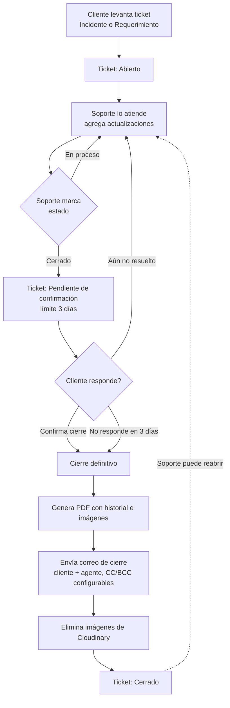

# Sistema de Tickets

Sistema interno de atención a clientes (soporte técnico) multi-empresa, hecho en Django. Permite que los clientes de varias empresas levanten incidentes o requerimientos, que un equipo de soporte los atienda, y que el cierre quede documentado y notificado por correo. El nombre mostrado en pantalla es configurable (ver `NOMBRE_SISTEMA` más abajo).

## ¿Qué hace el sistema?

- Cada **empresa** (cliente del sistema) tiene sus propios usuarios y tickets, aislados del resto.
- Los **clientes** levantan tickets (incidente o requerimiento), opcionalmente con imágenes de evidencia.
- El equipo de **soporte** los atiende desde una bandeja, agrega actualizaciones y, al resolverlos, el ticket pasa a **pendiente de confirmación** en vez de cerrarse de inmediato.
- El cliente confirma que quedó resuelto (o indica que no), y si no responde en 3 días el ticket se cierra solo.
- Al cerrarse (por confirmación o automático), se genera un **PDF con el historial completo** (incluye las imágenes antes de borrarlas), se manda un **correo de cierre**, y se liberan las imágenes de la nube.
- Todas las tablas del sistema (tickets, usuarios, empresas) tienen **filtros por columna** y se pueden **exportar a CSV o Excel**.

## Roles y permisos

| Rol | Puede |
|---|---|
| **Super admin** | Ver y editar todo, sin restricciones, en todas las empresas (incluidas las que se creen después). Puede crear otros administradores y eliminar usuarios permanentemente |
| **Agente de Soporte** | Ver y atender todos los tickets de sus empresas asignadas (bandeja, actualizaciones, cierres) |
| **Agente Cliente** | Levantar tickets, crear usuarios clientes de su empresa, activarlos/desactivarlos, restablecerles la contraseña, y ver (solo lectura) los tickets de todos los usuarios de su empresa |
| **Cliente** | Levantar tickets y ver/comentar únicamente los suyos |

El login acepta usuario **o correo electrónico**. El campo "Rol" al crear un usuario incluye la opción
**Administrador** (visible solo para un super admin), que da acceso total sin necesidad de asignar empresas.

Además existe una **cuenta de administrador protegida**: se crea sola después de cada `migrate` (si no
existe todavía) con los datos del `.env`, y no se puede editar, desactivar ni eliminar desde la interfaz
(ni siquiera por otro superadmin) — sirve como respaldo de acceso permanente al sistema. Ver la sección
de Configuración.

## Flujo habitual de un ticket



## Funcionalidades importantes

- **Imágenes en tickets**: hasta 3 por envío, 5MB cada una, almacenadas en **Cloudinary** (no en el servidor).
- **Cierre con confirmación del cliente**: nunca se cierra un ticket de forma directa al marcarlo "Cerrado"; siempre pasa por la etapa de confirmación. El auto-cierre por vencimiento se revisa cada vez que soporte carga la bandeja de tickets (no es un cron real).
- **PDF de cierre**: se genera con `reportlab`, se guarda en Cloudinary (almacenamiento tipo *raw*), y se adjunta directo en el correo (no se expone ningún link público desde la app).
- **Correo de cierre**: vía Gmail SMTP. Va al cliente y al agente que atendió; en copia el contacto alternativo si es un correo válido; en copia oculta siempre la dirección configurada en `EMAIL_BCC_CIERRE`.
- **Filtros y exportación**: cada tabla tiene una fila de filtros (uno por columna, con los valores reales encontrados) más un buscador general. Los botones de exportar (CSV/Excel) exportan exactamente lo que está filtrado/visible en pantalla, no la tabla completa. El Excel es un `.xlsx` real, generado en el navegador sin dependencias externas.
- **Zona horaria**: la base de datos guarda todo en UTC. Un middleware (`tickets/middleware.py`) detecta la zona horaria del navegador de cada visitante (vía cookie) y localiza automáticamente todas las fechas mostradas y exportadas — sin tocar cómo se almacenan.
- **Reloj y versión del sistema**: en el header de cada pantalla se muestra la hora en vivo con su zona horaria, y debajo la versión del sistema (`v<commits> (<hash>)`), calculada automáticamente desde el historial de git — avanza sola con cada commit/merge.
- **Borrado de empresas**: es un soft-delete (se marca `eliminada=True` y se renombra con fecha), nunca se borra de verdad para conservar el historial de tickets.
- **Empresas nuevas**: al crearse, se vinculan automáticamente a todos los administradores existentes.
- **Página de ayuda**: dentro del sistema, con explicación de roles y del flujo de un ticket para cualquier usuario.

## Gestión de usuarios y contraseñas

- **Alta de usuarios**: individual o por **carga masiva** (CSV con plantilla descargable). En ambos casos se genera un **PIN numérico de 4 dígitos** como contraseña y se manda un **correo de bienvenida** con los datos de acceso — el PIN nunca se muestra en pantalla ni en el CSV de resultado, solo llega por correo.
- **Restablecer contraseña**: un Agente Cliente o el administrador puede generarle un PIN nuevo a otro usuario; se le avisa por correo, sin exponerlo en pantalla.
- **Cambiar mi contraseña**: cualquier usuario logueado puede cambiar su propia contraseña desde el botón junto a "Cerrar sesión". Pide la contraseña actual, valida que la nueva sea de 4 números, avisa por correo, y no cierra la sesión.
- **Activar / desactivar**: soft-delete de usuarios — bloquea el login sin borrar su historial de tickets; reversible en cualquier momento.
- **Eliminar permanentemente** (solo super admin): borra la cuenta de verdad. Sus tickets **nunca se borran**: los que sigan abiertos se cierran automáticamente (motivo "Cerrado por eliminación de usuario", con su correo de cierre normal) y se conserva el nombre de usuario en el historial aunque la cuenta ya no exista. Un ticket sin cliente ya no se puede reabrir.

## Seguridad

- **Bloqueo por fuerza bruta** (`django-axes`): las contraseñas son un PIN de 4 dígitos (10,000 combinaciones), así que el login se bloquea tras 5 intentos fallidos por combinación usuario+IP, con 15 minutos de enfriamiento. Se puede desbloquear manualmente con `python manage.py axes_reset`.
- **Prevención de doble envío**: un script compartido (`_prevenir_doble_envio.html`) deshabilita el botón de cualquier formulario apenas se envía, para evitar duplicados por doble clic o conexión lenta. Respeta los diálogos de confirmación existentes (si se cancela, el botón no se deshabilita).
- **Nunca se muestran contraseñas en pantalla**: los PIN (de bienvenida, restablecimiento o cambio propio) solo se envían por correo, nunca aparecen en la interfaz ni en los CSV de resultado.

## Textos y marca configurables

Estas variables son opcionales (si no se definen, se usan los valores entre paréntesis):

- `NOMBRE_SISTEMA` (`Atención al Cliente`): nombre mostrado en el header de todas las pantallas, en los títulos de pestaña y en los correos.
- `TEXTO_SELECCION_EMPRESA` (`Selecciona una empresa`): texto del encabezado en la pantalla de inicio.

## Stack

- **Backend**: Django 5.2, SQLite (desarrollo).
- **Imágenes y PDFs**: Cloudinary (`django-cloudinary-storage`).
- **Correo**: SMTP (Gmail).
- **Seguridad**: `django-axes` (bloqueo de login).
- **Frontend**: HTML/CSS/JS simple por plantilla, sin frameworks ni build step.

## Configuración

### 1. Requisitos previos

- **Python 3.10 o superior** (el proyecto se desarrolló y probó con Python 3.10.11; cualquier 3.10.x–3.13.x
  funciona bien con Django 5.2). Descárgalo desde **[python.org/downloads](https://www.python.org/downloads/)**.
  Al instalar en Windows, marca la casilla **"Add python.exe to PATH"** antes de darle a Instalar — si se te
  pasó, puedes volver a correr el instalador y elegir "Modify" para agregarlo después.
  Verifica que quedó instalado abriendo una terminal y corriendo:
  ```
  python --version
  ```
- **Git** (para descargar el código y poder actualizarlo después). Descárgalo desde
  **[git-scm.com/downloads](https://git-scm.com/downloads)** e instálalo con las opciones por default.
  Verifica con:
  ```
  git --version
  ```
- Una cuenta de **[Cloudinary](https://cloudinary.com/)** (gratis) para las imágenes/PDFs, y un correo de
  Gmail con **contraseña de aplicación** (no la contraseña normal) para el envío de correos.

### 2. Descargar el proyecto

Tienes dos opciones para obtener el código:

**Opción A — Clonar con git (recomendada)**: deja el proyecto conectado al repositorio, así que más
adelante puedes traer actualizaciones con un solo comando (`git pull`).
```
git clone https://github.com/EliseoMx/tickets.git
cd tickets
```

**Opción B — Descargar el ZIP**: más simple, pero no vas a poder actualizar con `git pull` después (tendrías
que descargar el ZIP de nuevo cada vez). Útil si solo quieres probarlo una vez.
1. Entra a la página del repositorio: https://github.com/EliseoMx/tickets
2. Botón verde **"Code"** → **"Download ZIP"**.
3. Descomprime el archivo y abre una terminal dentro de esa carpeta.

### 3. Crear el entorno virtual e instalar dependencias

Un entorno virtual mantiene las librerías de este proyecto separadas del resto de tu computadora.

```
python -m venv venv
```

Actívalo (repite este paso cada vez que abras una terminal nueva para trabajar en el proyecto):
- Windows (PowerShell): `venv\Scripts\Activate.ps1`
- Windows (cmd): `venv\Scripts\activate.bat`
- Mac/Linux: `source venv/bin/activate`

Con el entorno activado (verás `(venv)` al inicio de la línea de tu terminal), instala las dependencias:
```
pip install -r requirements.txt
```

### 4. Configurar las variables de entorno

Copia `.env.example` a un archivo nuevo llamado `.env` (en la raíz del proyecto) y completa:
   - `CLOUDINARY_CLOUD_NAME`, `CLOUDINARY_API_KEY`, `CLOUDINARY_API_SECRET`
   - `EMAIL_HOST_USER`, `EMAIL_HOST_PASSWORD` (contraseña de aplicación de Gmail)
   - `EMAIL_BCC_CIERRE` (correo que siempre recibe copia oculta al cerrar un ticket)
   - `ADMIN_PROTEGIDO_USERNAME`, `ADMIN_PROTEGIDO_EMAIL`, `ADMIN_PROTEGIDO_TELEFONO`, `ADMIN_PROTEGIDO_PASSWORD`
     (opcional pero recomendado: datos de la cuenta protegida que se crea sola; nunca subir estos valores a git)
   - `NOMBRE_SISTEMA`, `TEXTO_SELECCION_EMPRESA` (opcional, ver sección de textos configurables)
   - `PORT` (opcional; puerto donde corre `runserver`, por default 8000)
   - `SECRET_KEY`, `DEBUG`, `ALLOWED_HOSTS` (ver explicación abajo — para desarrollo local casi nunca hay que tocarlos)

El archivo `.env` nunca se sube a git (ya está en `.gitignore`) — es solo para tu copia local.

#### `SECRET_KEY`: ¿qué es y de dónde se saca?

Es una clave que Django usa internamente para firmar cosas sensibles (sesiones de login, tokens, cookies
firmadas, etc.). Si alguien más la conoce, podría falsificar sesiones de otros usuarios en tu sistema.

- **Para desarrollo local**: puedes dejarla vacía en tu `.env` — el sistema usa automáticamente una clave de
  respaldo (definida en `config/settings.py`) para que no tengas que preocuparte por esto mientras pruebas
  en tu computadora.
- **Para producción** (cuando el sistema se vaya a instalar en un servidor real, accesible por otras
  personas): **genera una propia y única**, nunca reutilices la de desarrollo. Se genera así:
  ```
  python -c "from django.core.management.utils import get_random_secret_key; print(get_random_secret_key())"
  ```
  Copia el resultado y pégalo en `SECRET_KEY=` dentro del `.env` **de ese servidor** (no del repositorio).
  Si esta clave se filtra o cambia de servidor, mejor genera una nueva.

#### `DEBUG`: ¿qué es y cómo funciona?

Controla si Django muestra información técnica detallada (el error completo, la línea de código, las
variables en memoria) cuando algo falla, o si en cambio muestra una página de error genérica.

- `DEBUG=True` (para desarrollo local): útil mientras programas, porque ves exactamente qué falló y dónde.
  **Nunca debe usarse así en un servidor real** — esa información detallada también es visible para
  cualquier visitante, y puede exponer datos sensibles del sistema.
- `DEBUG=False` (para producción): si no se define en el `.env`, este es el valor por default — es la
  opción segura. Los errores se muestran de forma genérica al usuario, sin detalles internos.

En pocas palabras: en tu computadora para desarrollar dejas `DEBUG=True`; en cualquier servidor donde el
sistema quede accesible para otras personas, `DEBUG` debe estar en `False` (o simplemente no definirlo, ya
que ese es el default).

#### `ALLOWED_HOSTS`

Lista (separada por comas) de los dominios o IPs desde los que se puede servir el sistema — es una
protección contra cierto tipo de ataques que falsifican el encabezado `Host` de la petición. En desarrollo
local basta con `127.0.0.1,localhost` (ya viene así en el `.env.example`). En producción, agrega aquí el
dominio real (ej. `ALLOWED_HOSTS=midominio.com,www.midominio.com`).

### 5. Preparar la base de datos y arrancar

```
python manage.py migrate
python manage.py runserver
```

Abre `http://127.0.0.1:8000/` (o el puerto que hayas puesto en `PORT`) en tu navegador.

### Para actualizar el proyecto más adelante

Si lo descargaste con `git clone` (Opción A), cuando haya cambios nuevos en el repositorio solo necesitas:
```
git pull
pip install -r requirements.txt
python manage.py migrate
```
(los últimos dos pasos no siempre son necesarios, pero no está de más correrlos por si hay dependencias o
cambios de base de datos nuevos).

## Despliegue en Windows con IIS

Todo lo de esta sección es para cuando el sistema vaya a instalarse en un servidor Windows real, accesible
para otras personas (no aplica a tu ambiente de desarrollo local, que sigue funcionando con `runserver`
exactamente igual que antes).

### 1. Servidor WSGI: Waitress

`runserver` es solo para desarrollo. En Windows, el equivalente de producción a Gunicorn (que no funciona
en Windows) es **Waitress**, ya incluido en `requirements.txt`. Se levanta así:
```
waitress-serve --host=127.0.0.1 --port=8000 config.wsgi:application
```
Esto deja el sistema escuchando solo en `127.0.0.1:8000` (no expuesto directo a internet — ese es trabajo
de IIS, ver el punto 4).

Para que seguir corriendo después de reiniciar el servidor (sin depender de una terminal abierta), regístralo
como servicio de Windows con **[NSSM](https://nssm.cc/)**:
```
nssm install SistemaTickets "C:\ruta\al\proyecto\venv\Scripts\waitress-serve.exe" --host=127.0.0.1 --port=8000 config.wsgi:application
nssm start SistemaTickets
```

### 2. Archivos estáticos

Antes de arrancar en producción, junta los archivos estáticos (CSS/JS) en una sola carpeta para que IIS los
sirva directamente:
```
python manage.py collectstatic
```
Esto los copia a la carpeta `staticfiles/` (ya excluida de git). En IIS, configura esa carpeta como un
directorio virtual apuntando a `static/` para que se sirvan sin pasar por Django/Waitress.

### 3. Variables de entorno del servidor

En el `.env` **del servidor** (no el de tu compu):
```
DEBUG=False
ALLOWED_HOSTS=tu-dominio-o-ip-real
SECRET_KEY=<genera una nueva, ver sección de Configuración de arriba>
```

### 4. IIS como proxy inverso

1. Activa **IIS** en el servidor ("Activar o desactivar las características de Windows" → Internet
   Information Services).
2. Instala los módulos gratuitos de Microsoft **[URL Rewrite](https://www.iis.net/downloads/microsoft/url-rewrite)**
   y **[Application Request Routing (ARR)](https://www.iis.net/downloads/microsoft/application-request-routing)**.
3. Crea un sitio en IIS Manager apuntando a una carpeta cualquiera (puede ser vacía), y copia ahí el archivo
   de ejemplo [`deploy/iis/web.config`](deploy/iis/web.config) — define la regla que reenvía todo el tráfico
   que llega a IIS hacia `http://127.0.0.1:8000` (donde corre Waitress).
4. En el firewall de Windows, **bloquea el puerto 8000 hacia afuera** — solo IIS (puertos 80/443) debe
   quedar expuesto a internet; Waitress solo debe ser alcanzable desde el propio servidor.
5. Para HTTPS, instala un certificado en IIS — gratis con Let's Encrypt usando
   **[win-acme](https://www.win-acme.com/)**.

#### Usar otro puerto interno (si el 8000 ya está ocupado)

Esta guía usa el puerto **8000** para la comunicación interna entre IIS y Waitress (pasos 1 y 4 de arriba).
Ese puerto **nunca queda expuesto a internet** — solo lo usan IIS y Waitress para hablar entre sí dentro del
mismo servidor. Si en el servidor destino ese puerto ya lo usa otro sistema interno, elige otro (por ejemplo
`8100`) y ponlo en estos 3 lugares, para que coincidan entre sí:

1. **El comando de Waitress** (paso 1, "Servidor WSGI"):
   ```powershell
   waitress-serve --host=127.0.0.1 --port=8100 config.wsgi:application
   ```
2. **El servicio de NSSM**:
   ```powershell
   nssm install SistemaTickets "C:\ruta\al\proyecto\venv\Scripts\waitress-serve.exe" --host=127.0.0.1 --port=8100 config.wsgi:application
   ```
3. **El `web.config` de IIS** ([`deploy/iis/web.config`](deploy/iis/web.config)), cambia:
   ```xml
   <action type="Rewrite" url="http://127.0.0.1:8100/{R:1}" />
   ```

Y en el firewall de Windows, bloquea hacia afuera el puerto que hayas elegido (8100 en este ejemplo) en vez
del 8000.

La dirección pública del sistema (el dominio o IP que usa la gente) **no cambia** con esto — sigue siendo la
de IIS en el puerto 80/443 de siempre; este puerto interno es invisible para cualquiera fuera del servidor.

> Nota: la variable `PORT=8000` del `.env` es algo distinto — solo aplica a `python manage.py runserver` en
> desarrollo local, y de hecho Django no la lee automáticamente (el puerto de `runserver` se define al
> escribir el comando, ej. `runserver 9000`). No tiene relación con el puerto interno de Waitress en
> producción.

### 5. Base de datos (opcional): pasar de SQLite a PostgreSQL

Si vas a tener varios agentes/clientes usando el sistema al mismo tiempo, conviene cambiar de SQLite a
PostgreSQL (ver también la explicación general en la conversación de configuración). En el `.env` del
servidor:
```
DB_ENGINE=postgresql
DB_NAME=tickets_db
DB_USER=tickets_app
DB_PASSWORD=<contraseña fuerte>
DB_HOST=localhost
DB_PORT=5432
```
Si `DB_ENGINE` no se define (o no es `postgresql`), el sistema sigue usando SQLite automáticamente — no es
obligatorio cambiarlo. El servidor de PostgreSQL debe quedar configurado para escuchar solo en `localhost`
(nunca expuesto directo a internet), igual que Waitress.

### 6. Base de datos (alternativa): SQL Server

También se puede usar **Microsoft SQL Server** (Express u otra edición) en vez de PostgreSQL o SQLite.
Requiere tener instalado en Windows el **ODBC Driver 17 (o superior) for SQL Server** (normalmente ya viene
con la instalación del motor de SQL Server) y los paquetes `mssql-django`/`pyodbc` (ya incluidos en
`requirements.txt`). En el `.env`:
```
DB_ENGINE=mssql
DB_NAME=tickets_db
DB_USER=tickets_app
DB_PASSWORD=<contraseña fuerte>
DB_HOST=localhost\SQLEXPRESS
DB_ODBC_DRIVER=ODBC Driver 17 for SQL Server
```
Si tu instancia no es nombrada (instalación por default sin `\SQLEXPRESS`), usa `DB_HOST=localhost` y
`DB_PORT=1433`. Igual que con PostgreSQL, si `DB_ENGINE` no se define el sistema sigue usando SQLite.

#### Crear la base de datos y el login automáticamente

Django crea las tablas solo (vía `migrate`), pero **no crea la base de datos ni el login** — eso hay que
hacerlo antes, a mano con SSMS o con el script [`deploy/mssql/bootstrap_db.ps1`](deploy/mssql/bootstrap_db.ps1)
que automatiza ambos pasos en uno. Requiere tener SQL Server ya instalado y corriendo (y un login
administrador, normalmente `sa`, con modo mixto de autenticación activado).

Desde PowerShell, en la raíz del proyecto:
```powershell
.\deploy\mssql\bootstrap_db.ps1 -SaPassword "<contraseña del sa>" -AppPassword "<contraseña nueva para la app>" -RunMigrate
```

Esto:
1. Crea la base de datos (`tickets_db` por default) si no existe.
2. Crea un login/usuario dedicado para la app (`tickets_app` por default, nunca usa `sa`) si no existe.
3. Con `-RunMigrate`, corre de una vez `python manage.py migrate` contra esa base.
4. Al final imprime las líneas exactas que debes copiar a tu `.env`.

Es seguro correrlo varias veces — si la base o el login ya existen, no hace nada y sigue de largo. Parámetros
opcionales: `-SqlInstance` (default `localhost\SQLEXPRESS`), `-DbName` y `-AppLogin` (para usar otro nombre
de base o de usuario).

#### Crear todo (base de datos, login y tablas) con un solo script `.sql`

Si vas a instalar el sistema en otro servidor y quieres hacerlo sin PowerShell ni Python instalado ahí
todavía, usa [`deploy/mssql/schema.sql`](deploy/mssql/schema.sql). Es un único script T-SQL que crea **la
base de datos, el login/usuario de la app, y todas las tablas** (generadas a partir de las migraciones del
proyecto) — todo en un solo paso.

**1. Ábrelo en SSMS**, conéctate a la instancia de SQL Server (a cualquier base, ej. `master`) con un login
administrador (ej. `sa`), y dale **Execute** (`F5`). O con `sqlcmd`:
```powershell
sqlcmd -S localhost\SQLEXPRESS -U sa -P "<contraseña del sa>" -i deploy\mssql\schema.sql
```

Por default crea la base `tickets_db` y el login `tickets_app` con una contraseña de ejemplo — **antes de
correrlo, abre el archivo y cambia esa contraseña** (aparece una sola vez, en el `CREATE LOGIN`, cerca del
principio). Si quieres otro nombre de base o de login, usa Buscar y Reemplazar en todo el archivo. Es seguro
correrlo varias veces: si la base, el login o las tablas ya existen, no se vuelven a crear.

**2. Ajusta el `.env`** de ese servidor con los datos de esa base (`DB_ENGINE=mssql`, `DB_NAME`, `DB_USER`,
`DB_PASSWORD`, `DB_HOST`) — **no hace falta correr `python manage.py migrate` ahí**, porque el script ya
deja registradas las migraciones como aplicadas (Django lo reconoce como "sin migraciones pendientes").

**3. Arranca la app normalmente** ahí (ver la sección de despliegue con IIS más abajo, o `runserver` si es
solo para probar).

Si más adelante agregas migraciones nuevas al proyecto, regenera el script:
```powershell
python deploy/mssql/generate_schema_sql.py
```
Más detalles y notas técnicas en [`deploy/mssql/README.md`](deploy/mssql/README.md). (`bootstrap_db.ps1`, de
la sección anterior, sigue disponible como alternativa si prefieres PowerShell en vez de un `.sql`.)
