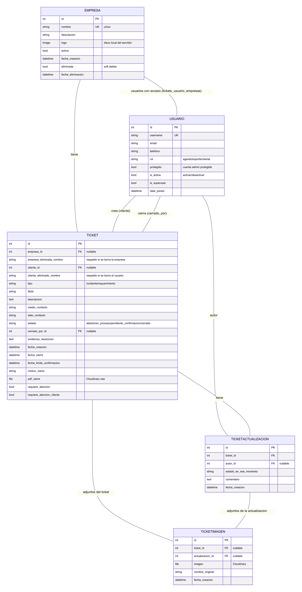

# Documentación de la base de datos — Sistema de Tickets

Este documento explica para qué sirve cada tabla del sistema y qué guarda cada campo, pensado para que cualquiera (no solo quien programó el sistema) pueda entenderlo. Se genera automáticamente con `generate_documentation_pdf.py` a partir de los modelos reales del proyecto (`tickets/models.py`).

## Diagrama de relaciones (ERD)

*(Si no ves la imagen, ábrela directo: [`diagrama_erd.png`](diagrama_erd.png) o [`diagrama_erd.svg`](diagrama_erd.svg))*

## Tablas del sistema (las que importan para el negocio)

### `tickets_empresa` (modelo `Empresa`)

Cada empresa/cliente que usa el sistema. Sus tickets, los usuarios con acceso a ella, y su logo cuelgan de este registro.

| Campo | Tipo (SQL Server) | Para qué sirve |
|---|---|---|
| `id` | int | Llave primaria, autoincremental. |
| `nombre` | nvarchar(150) | Nombre de la empresa. Unico: no puede haber dos empresas con el mismo nombre. |
| `descripcion` | nvarchar(255) | Texto libre opcional, puede quedar vacio. |
| `logo` | nvarchar(100) | Ruta del archivo de imagen del logo. Se guarda en el propio servidor (carpeta media/empresas/), no en Cloudinary, porque son pocas imagenes y ligeras. |
| `activa` | bit | Si esta en False, no se muestra a los clientes ni se pueden levantar tickets nuevos para esa empresa. |
| `fecha_creacion` | datetimeoffset | Se llena sola al crear el registro (auto_now_add). |
| `eliminada` | bit | Marca de borrado suave (soft delete). En True significa que la empresa ya no existe para el sistema, pero sus tickets se conservan con el nombre guardado aparte. |
| `fecha_eliminacion` | datetimeoffset | Cuando se marco como eliminada. NULL si nunca se elimino. |

### `tickets_usuario` (modelo `Usuario`)

Todas las cuentas del sistema: superadministradores, Agentes Cliente, Agentes de Soporte, y Clientes. Extiende el modelo de usuario estandar de Django (hereda username, password, is_active, is_superuser, date_joined, last_login, first_name, last_name, ademas de los campos propios listados abajo).

| Campo | Tipo (SQL Server) | Para qué sirve |
|---|---|---|
| `id` | int | Llave primaria, autoincremental. |
| `username` | nvarchar(150) | Nombre de usuario para iniciar sesion. Unico. |
| `password` | nvarchar(128) | Contrasena, guardada con hash (nunca en texto plano). En este sistema las contrasenas son PIN de 4 digitos. |
| `email` | nvarchar(254) | Correo electronico. El login tambien acepta el correo, no solo el username. |
| `telefono` | nvarchar(20) | Telefono de contacto, obligatorio. |
| `rol` | nvarchar(10) | Uno de: agente (Agente Cliente), soporte (Agente de Soporte), cliente. Los superadministradores no usan este campo, se identifican por is_superuser=True. |
| `protegido` | bit | Si es True, es la cuenta de administrador protegida del sistema (creada sola desde el .env) — no se puede editar, desactivar ni eliminar desde la interfaz. |
| `is_active` | bit | Controla si el usuario puede iniciar sesion (se usa para activar/desactivar cuentas sin borrarlas). |
| `is_superuser` | bit | True para los administradores del sistema (acceso total, sin restriccion de empresa). |
| `is_staff` | bit | Heredado de Django; controla acceso al panel /admin. No se expone en la interfaz normal del sistema. |
| `date_joined` | datetimeoffset | Fecha de alta de la cuenta. |
| `last_login` | datetimeoffset | Ultima vez que inicio sesion. NULL si nunca ha entrado. |

### `tickets_usuario_empresas` (modelo `Usuario.empresas (relacion muchos-a-muchos)`)

Tabla intermedia que conecta usuarios con las empresas a las que tienen acceso (un Agente Cliente/Soporte o Cliente puede tener acceso a mas de una empresa, y una empresa puede tener varios usuarios). No tiene modelo propio en el codigo: Django la crea automaticamente a partir del campo Usuario.empresas.

| Campo | Tipo (SQL Server) | Para qué sirve |
|---|---|---|
| `id` | int | Llave primaria, autoincremental. |
| `usuario_id` | int | Llave foranea a tickets_usuario. |
| `empresa_id` | int | Llave foranea a tickets_empresa. |

### `tickets_ticket` (modelo `Ticket`)

El corazon del sistema: cada incidente o requerimiento levantado por un cliente. Guarda todo su ciclo de vida, desde que se crea hasta que se cierra.

| Campo | Tipo (SQL Server) | Para qué sirve |
|---|---|---|
| `id` | int | Llave primaria, autoincremental. Es el numero de ticket (#1, #2, etc.). |
| `empresa_id` | int (FK, NULL) | Empresa a la que pertenece el ticket. Puede quedar NULL si la empresa se elimino permanentemente (ver empresa_eliminada_nombre). |
| `empresa_eliminada_nombre` | nvarchar(150) | Copia del nombre de la empresa, guardada solo si esa empresa se elimino permanentemente despues (para no perder el dato en el historial). |
| `cliente_id` | int (FK, NULL) | Usuario que levanto el ticket. Puede quedar NULL si esa cuenta se elimino permanentemente. |
| `cliente_eliminado_nombre` | nvarchar(150) | Copia del username del cliente, guardada solo si esa cuenta se elimino permanentemente despues. |
| `tipo` | nvarchar(15) | incidente o requerimiento. |
| `titulo` | nvarchar(150) | Titulo corto del ticket. |
| `descripcion` | text | Descripcion completa escrita por el cliente al crear el ticket. |
| `medio_contacto` | nvarchar(10) | telefono, correo o whatsapp — como prefiere que le contacten. |
| `dato_contacto` | nvarchar(150) | El numero, correo o usuario de WhatsApp segun lo elegido arriba. |
| `contacto_alternativo` | nvarchar(150) | Opcional: otro dato de contacto por si no logran localizar al cliente con el principal. |
| `estado` | nvarchar(25) | abierto, en_proceso, pendiente_confirmacion o cerrado. |
| `cerrado_por_id` | int (FK, NULL) | Agente de soporte que dejo el ticket listo para cierre. NULL si esa cuenta se elimino, o si el ticket sigue abierto. |
| `evidencia_resolucion` | text | Detalle de lo que hizo soporte para resolver o avanzar el ticket. |
| `fecha_creacion` | datetimeoffset | Se llena sola al crear el ticket. |
| `fecha_actualizacion` | datetimeoffset | Se actualiza sola cada vez que el registro cambia. |
| `fecha_cierre` | datetimeoffset | Cuando se cerro definitivamente. NULL mientras siga abierto. |
| `fecha_limite_confirmacion` | datetimeoffset | Si el cliente no confirma el cierre antes de esta fecha (3 dias), el ticket se cierra solo. |
| `motivo_cierre` | nvarchar(20) | cliente (confirmo el cliente), automatico (por vencimiento), eliminacion_usuario o eliminacion_empresa (se cerro porque se elimino la cuenta/empresa). |
| `pdf_cierre` | nvarchar(100) | Ruta del PDF con el historial completo del ticket, generado al cerrarse. Se guarda en Cloudinary (como recurso 'raw', para que se pueda descargar). |
| `requiere_atencion` | bit | True cuando el cliente agrego un comentario que soporte todavia no ha visto. |
| `requiere_atencion_cliente` | bit | True cuando soporte agrego una actualizacion que el cliente todavia no ha visto. |

### `tickets_ticketactualizacion` (modelo `TicketActualizacion`)

Cada comentario/actualizacion agregada a un ticket (por soporte o por el cliente), con el estado del ticket en ese momento. Es el historial de conversacion de cada ticket.

| Campo | Tipo (SQL Server) | Para qué sirve |
|---|---|---|
| `id` | int | Llave primaria, autoincremental. |
| `ticket_id` | int (FK) | A que ticket pertenece esta actualizacion. |
| `autor_id` | int (FK, NULL) | Quien la escribio. NULL si esa cuenta se elimino despues. |
| `estado_en_ese_momento` | nvarchar(25) | En que estado quedo el ticket justo despues de este comentario. |
| `comentario` | text | El texto del comentario. |
| `fecha_creacion` | datetimeoffset | Se llena sola al crear el registro. |

### `tickets_ticketimagen` (modelo `TicketImagen`)

Archivos adjuntos (imagenes o PDF) subidos a un ticket, ya sea al crearlo o en una actualizacion posterior. Hasta 3 por envio, 5MB cada uno.

| Campo | Tipo (SQL Server) | Para qué sirve |
|---|---|---|
| `id` | int | Llave primaria, autoincremental. |
| `ticket_id` | int (FK, NULL) | Si el adjunto se subio al crear el ticket. NULL si se subio en una actualizacion (ver actualizacion_id). |
| `actualizacion_id` | int (FK, NULL) | Si el adjunto se subio en una actualizacion posterior. NULL si se subio al crear el ticket. |
| `imagen` | nvarchar(100) | Ruta del archivo, guardado en Cloudinary. Los PDF van a una carpeta aparte (tickets/pdf/) para que el sistema sepa que deben descargarse como archivo, no mostrarse como imagen. |
| `nombre_original` | nvarchar(255) | Nombre del archivo tal como lo subio el usuario (Cloudinary no conserva la extension original en el nombre que guarda). |
| `fecha_creacion` | datetimeoffset | Se llena sola al subir el archivo. |

## Dónde se guardan los archivos

| Qué | Dónde | Detalle |
|---|---|---|
| Logo de empresa (Empresa.logo) | Disco del propio servidor | carpeta media/empresas/ del proyecto |
| Imagenes/PDF adjuntos a tickets (TicketImagen.imagen) | Cloudinary (nube) | carpeta tickets/ o tickets/pdf/ segun el tipo de archivo |
| PDF de cierre de ticket (Ticket.pdf_cierre) | Cloudinary (nube, recurso tipo 'raw') | carpeta cierres/ |

Importante: en la base de datos **nunca se guarda el archivo en sí**, solo la ruta/nombre de dónde está guardado (en el servidor o en Cloudinary). Por eso migrar solo la base de datos (con `schema.sql` o `dumpdata`/`loaddata`) no mueve las imágenes ni PDFs — esos viven aparte, en el disco del servidor o en Cloudinary.

## Tablas internas de Django y de terceros

Estas tablas las crea Django (o las librerías `django-axes` y el propio framework de autenticación) para su propio funcionamiento interno — no son parte del diseño de este proyecto y normalmente no hace falta tocarlas directamente.

| Tabla | Para qué sirve |
|---|---|
| `auth_group` | Grupos de permisos de Django. No se usan activamente en este sistema — el acceso se controla con el campo 'rol' de Usuario, no con grupos. |
| `auth_permission` | Catalogo de todos los permisos posibles del sistema, generado automaticamente por Django a partir de los modelos. |
| `auth_group_permissions` | Relacion entre grupos (auth_group) y permisos (auth_permission). No se usa activamente. |
| `tickets_usuario_groups` | Relacion entre usuarios y grupos de Django. No se usa activamente. |
| `tickets_usuario_user_permissions` | Permisos individuales asignados directamente a un usuario. No se usa activamente (se usa el campo 'rol' en su lugar). |
| `django_content_type` | Catalogo interno de todos los modelos del sistema. Lo usa el panel /admin de Django y el sistema de permisos. |
| `django_admin_log` | Historial de acciones realizadas desde el panel /admin de Django (crear/editar/borrar registros ahi). |
| `django_migrations` | Registro de que migraciones (cambios de estructura de la base de datos) ya se aplicaron. Django lo usa para saber si falta actualizar algo. |
| `django_session` | Sesiones de usuarios con sesion iniciada (relacionado con la cookie que mantiene la sesion activa en el navegador). |
| `axes_accessattempt` | Registro de intentos de inicio de sesion fallidos, usado por django-axes para bloquear despues de 5 intentos fallidos. |
| `axes_accesslog` | Historial de todos los intentos de inicio de sesion, exitosos y fallidos. |
| `axes_accessattemptexpiration` | Control interno de cuando expira un bloqueo por intentos fallidos (el 'enfriamiento' de 15 minutos). |
| `axes_accessfailurelog` | Detalle adicional de cada fallo de inicio de sesion, usado internamente por django-axes. |

